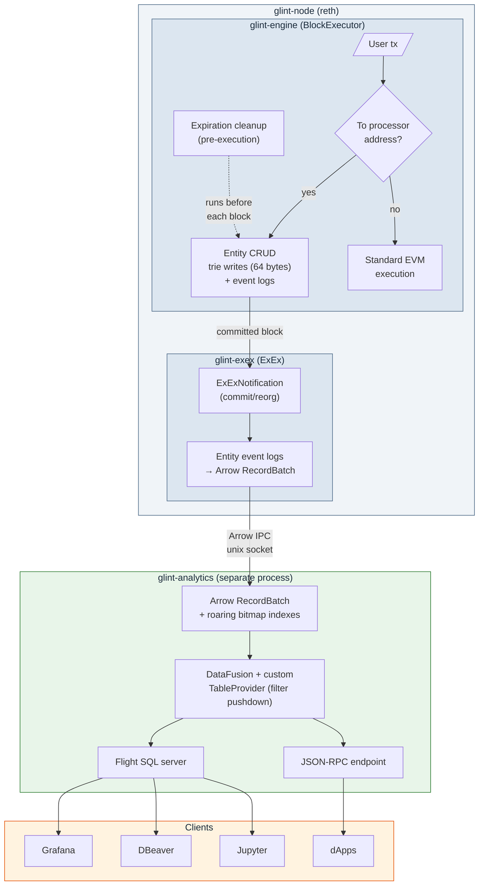

# Glint

[](https://github.com/vaporif/glint/actions/workflows/ci.yml)
[](https://github.com/vaporif/glint/actions/workflows/e2e.yml)

Ephemeral on-chain storage layer, built on reth.

Glint adds a BTL (Blocks-to-Live) primitive to Ethereum. Entities have a TTL, carry queryable annotations, and disappear when their time is up.

Runs as both a standalone Ethereum node (`eth-glint`) and an OP Stack L3 (`op-glint`)

**The full flow - node startup, entity creation, ExEx streaming, and Flight SQL queries - is covered by e2e tests**.

## Why

Blockchains store data permanently. If you want to publish a limit order that's valid for the next 10 blocks, you pay to store it forever even though nobody needs it after that. There's no native TTL in Ethereum.

Think CoW Swap orders valid for minutes, oracle price feeds stale after a few blocks, compute marketplace offers that expire when filled, ephemeral task boards for AI agents. Anywhere people publish short-lived structured records and others need to query them by metadata.

## Getting started

Requires [Nix](https://nixos.org/) with flakes enabled, or Rust nightly + the tools listed in `flake.nix`.

```bash
# enter dev shell (installs rust toolchain, cargo-nextest, taplo, typos, etc.)
nix develop
# or: direnv allow

# build everything
just build

# run all checks (clippy + tests + fmt + lint)
just check
```

### Run locally

Terminal 1 - start the node in dev mode (auto-mines blocks every second):

```bash
just run-eth --dev --dev.block-time 1000ms --http
# or for OP Stack: just run-op --dev --dev.block-time 1000ms --http
```

Terminal 2 - start the analytics sidecar (connects to the node's ExEx socket):

```bash
just run-analytics
```

The node listens on `localhost:8545` (JSON-RPC). Analytics exposes Flight SQL on `localhost:50051` and health on `localhost:8080`.

### Query entities

Any Flight SQL client works. With `arrow-flight` CLI or DBeaver, connect to `localhost:50051`:

```sql
SELECT entity_key, content_type, expires_at_block FROM entities;

-- annotation lookups (bitmap-indexed)
SELECT * FROM entities WHERE str_ann(string_annotations, 'pair') = 'USDC/WETH';
SELECT * FROM entities WHERE num_ann(numeric_annotations, 'price') > 1000;
SELECT * FROM entities WHERE owner = x'aa...' AND num_ann(numeric_annotations, 'price') >= 500;
```
`str_ann` / `num_ann` are UDF I'm still evaluating if thould be removed as their removal is a more complex work that will require v2 but it is possible to have client facing normal sql with no strings attached.


## Relationship to Arkiv

Glint wouldn't exist without [Arkiv](https://github.com/Arkiv-Network/arkiv-op-geth) (formerly GolemBase). The Arkiv team designed the core model - magic address interception, BTL expiration, content-addressed keys, annotation model, atomic ops, owner-gated mutations.

Why rewrite instead of fork: Arkiv is an op-geth fork, and Optimism is phasing out op-geth in favor of reth. A geth fork is a dead end. Glint takes the same ideas and implements them as a reth plugin.

Beyond the base change, Glint also fixes a few things:

| | Arkiv | Glint | Why |
|---|---|---|---|
| Base | op-geth fork | reth plugin (BlockExecutor + ExEx) | Optimism is dropping op-geth. |
| On-chain cost | ~96 bytes/entity (3 slots) | 64 bytes/entity (2 slots) | Moved the expiration index off-chain. 33% cheaper per entity. |
| Content integrity | None | 32-byte content hash | Without it, a sequencer can serve fake data and nobody can prove it |
| Query engine | SQLite with bitmap indexes, in-process, custom JSON-RPC | DataFusion (columnar, in-memory) with secondary indexes, separate process, Flight SQL | Process isolation, columnar scans for analytics, indexed lookups for annotation filters. See [query engine](#query-engine). |
| Compression | Brotli per-tx | None | OP batcher already compresses. Per-tx Brotli has a decompression bomb in the txpool path (`io.ReadAll` with no size limit). |
| MAX_BTL | Not enforced | Enforced at txpool + execution | Without it, entities live forever. The "ephemeral" thing falls apart. |
| Extend | Permissionless, no cap | Per-entity policy (anyone or owner/operator), capped at MAX_BTL | Arkiv lets anyone extend any entity to infinity. Glint lets the creator choose. |
| Operator delegation | None | Optional operator per entity | Operator can update content and delete, but can't change permissions. So your backend can manage your entities without owning them. |
| ChangeOwner | Supported | Removed | Delete + recreate is simpler, doesn't break external key references (might add though + operator change) |

## Architecture



`glint-engine` is a custom `BlockExecutor` inside reth. Transactions sent to a magic address (`0x...676c696e74`, ASCII "glint") get intercepted as entity operations - create, update, delete, extend. Everything else goes through normal EVM execution. Each entity costs 64 bytes on-chain: 32 bytes of metadata (owner + expiration) and 32 bytes of content hash. Expired entities get cleaned up before each block's transactions run.

`glint-exex` watches committed blocks, converts entity event logs into Arrow RecordBatches, and pushes them over a unix socket. No state of its own.

`glint-analytics` is a separate binary that consumes that stream. It holds all live entities in memory as Arrow columnar data with roaring bitmap indexes on owner, string annotations, and numeric annotations (hash + B-tree for range queries). Queries go through DataFusion and Flight SQL, plus a JSON-RPC endpoint. If it crashes or falls behind, blocks keep producing - the node doesn't know or care.

### Query engine

Everything lives in memory. Glint entities expire, so the live set is bounded by creation rate times MAX_BTL. For realistic workloads - intent protocols, oracle feeds, compute marketplaces - that's tens of thousands to low hundreds of thousands of active entities, not millions. Orders expire in minutes, price feeds even faster. At 100K entities with 10 annotations each and ~500 byte payloads, you're looking at ~100MB. Even aggressive usage stays under a gigabyte.

Entity data is stored as Arrow RecordBatches - columnar, cache-friendly. DataFusion runs analytical queries (aggregations, GROUP BY, window functions) with vectorized execution directly on this data. Nothing gets serialized between formats - Arrow from ExEx through to query results.

Pure columnar has a problem though: annotation lookups ("find all USDC/WETH orders where price > 3500") hit every row. Arkiv solved this with SQLite bitmap indexes but gave up columnar analytics in the process.

Secondary indexes sit alongside the Arrow data - hash indexes on annotation key/value pairs and owner, a B-tree for numeric range queries, all backed by roaring bitmaps. A custom DataFusion `TableProvider` checks incoming filters against these indexes. If a filter matches an indexed field, it resolves via bitmap lookup in microseconds. If not, DataFusion does a full columnar scan, which is still fast for analytics. One engine, one copy of the data.

Also if we do need to support longer lasting entities that wont fit inside RAM, there's an option of datafusion table provider https://github.com/datafusion-contrib/datafusion-table-providers. It will use any of supported databases (including sqlite,) as storage, so datafusion while push down data there and will only supply Flight SQL as protocol layer. We will lose OLAP though.

Supported indexed operations: equality and inequality on `owner`, `str_ann()`, and `num_ann()`; range queries (`>`, `>=`, `<`, `<=`) on numeric annotations; `IN` lists on all indexed fields; `AND`/`OR` combinations. Unrecognized filters fall through to DataFusion's post-scan filtering.

<details>
<summary>Other query engines considered</summary>

- SQLite - good indexes, but row-oriented. Loses columnar analytics and needs Arrow-to-row conversion on every ingest. Considered as a backend behind DataFusion, but unnecessary when the live entity set fits in memory.
- DuckDB - C++ with Rust FFI. Fast, but adds a C++ dependency and ~30MB to the binary.
- SpacetimeDB - standalone server, can't use as a library. BSL licensed.
- ClickHouse via chdb-rust - ~125 downloads/month, experimental API, 300MB shared library.
- SurrealDB - BSL license and full DB engine overhead.
- Materialize / ReadySet / RisingWave - streaming SQL, all need separate servers. Materialize and ReadySet are BSL.
- Feldera (DBSP) - MIT licensed, but SQL layer needs a Java (Apache Calcite) build step.
- Parquet files from ExEx - duplicates data already in MDBX, reads are always stale, file management becomes the ExEx's problem.
</details>

## How it works

### Entity lifecycle

1. **Create** (anyone) - Send a transaction to the processor address with RLP-encoded `GlintTransaction` operations. The sender becomes the owner. The entity gets a deterministic key (`keccak256(tx_hash || payload_len || payload || op_index)`), 64 bytes written to trie, and a lifecycle event log emitted. The full payload lives only in the event log, not in the trie. You can optionally set an `operator` and an `extend_policy` at creation time.

   A 32-byte content hash (`keccak256(payload || content_type || rlp(annotations))`) goes on-chain so clients can verify query results against the trie. A malicious sequencer can't serve altered data without the hash mismatch showing up in a Merkle proof.

2. **Update** (owner or operator) - Replace payload and annotations, reset the BTL. Same key, new content. The operator can update content and BTL but cannot change permissions (extend_policy or operator) - only the owner can do that.

3. **Extend** (depends on policy) - Add blocks to remaining lifetime, capped at MAX_BTL. If `extend_policy` is `AnyoneCanExtend`, anyone can do this - so if you depend on someone's data, you can keep it alive. If `OwnerOnly`, only the owner or operator can extend.

4. **Delete** (owner or operator) - Immediate removal.

5. **Expire** (automatic) - At the start of each block, before any transactions execute, the engine checks an in-memory expiration index (`HashMap<BlockNumber, Vec<EntityKey>>`) and removes everything whose TTL has elapsed. The index isn't stored on-chain - on cold start it rebuilds by scanning MAX_BTL blocks of event logs.

### Recovery

Everything in-memory rebuilds from the chain. No snapshots, no separate sync mode.

On node restart, `glint-engine` scans MAX_BTL blocks of entity event logs from reth's database to reconstruct the expiration index. Log reading only, not EVM re-execution - at ~1 week of history (302,400 blocks at 2s) this takes seconds to a few minutes.

On analytics restart, `glint-analytics` connects to the ExEx IPC stream and rebuilds from empty. The ExEx replays from its WAL checkpoint, and after MAX_BTL blocks from tip all live entities are reconstructed. Anything older is already expired. Crash, disconnect, fresh deploy - same path every time.

If the ExEx's IPC buffer overflows (1024 batches, ~34 min of headroom at 2s blocks), it disconnects glint-analytics, which rebuilds from scratch on reconnect. If the ExEx itself panics, reth keeps producing blocks and the WAL retains notifications until the ExEx catches up.

## License

Licensed under either of [Apache License, Version 2.0](LICENSE-APACHE) or [MIT License](LICENSE-MIT) at your option.
