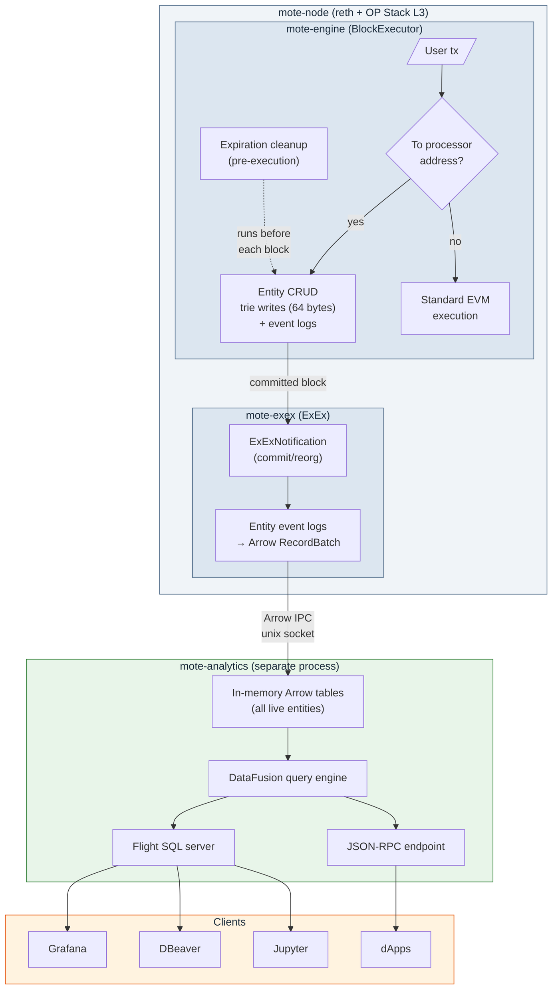

# Mote

Ephemeral on-chain storage as an OP Stack L3, built on reth.

Mote adds a BTL (Blocks-to-Live) primitive to Ethereum - you create entities with a TTL, attach annotations, query them with SQL, and they disappear when their time is up.

## Why

Blockchains store data permanently. If you want to publish a limit order that's valid for the next 10 blocks, you pay to store it forever even though nobody needs it after that. There's no native TTL in Ethereum.

Think intent protocols (UniswapX/CoW), ephemeral registries, oracle price feeds with built-in staleness, compute marketplaces, AI agent coordination - anywhere people publish short-lived structured records and others need to query them.

## Relationship to GolemBase

Mote wouldn't exist without [GolemBase](https://github.com/ArkivNetwork/golembase-op-geth) (also called Arkiv). The GolemBase team designed the core model - magic address interception, BTL expiration, content-addressed keys, annotation model, atomic ops, owner-gated mutations.

Why rewrite instead of fork: GolemBase is an op-geth fork, and Optimism is phasing out op-geth in favor of reth. A geth fork is a dead end. Mote takes the same ideas and implements them as a reth plugin.

Beyond the base change, Mote also fixes a few things:

| | GolemBase | Mote | Why |
|---|---|---|---|
| Base | op-geth fork | reth plugin (BlockExecutor + ExEx) | Optimism is dropping op-geth. |
| On-chain cost | ~96 bytes/entity (3 slots) | 64 bytes/entity (2 slots) | Moved the expiration index off-chain. 33% cheaper per entity. |
| Content integrity | None | 32-byte content hash | Without it, a sequencer can serve fake data and nobody can prove it |
| Query engine | SQLite (in-process goroutine) | DataFusion (separate process, Arrow streaming) | See [why Arrow + DataFusion](#why-arrow--datafusion-not-sqlite) |
| Compression | Brotli per-tx | None | OP batcher already compresses. Per-tx Brotli has a decompression bomb in the txpool path (`io.ReadAll` with no size limit). |
| MAX_BTL | Not enforced | Enforced at txpool + execution | Without it, entities live forever. The "ephemeral" thing falls apart. |
| Extend | Permissionless, no cap | Permissionless, capped at MAX_BTL | GolemBase lets anyone extend any entity to infinity |
| Gas | Zero (hardcoded `GasUsed: 0`) | Proportional to cost (planned) | Zero gas = free operations = DoS |
| ChangeOwner | Supported | Removed | Delete + recreate is simpler, doesn't break external key references |

## Architecture



`mote-engine` is a custom `BlockExecutor` inside reth. Transactions sent to a magic address (`0x...6d6f7465`, ASCII "mote") get intercepted as entity operations - create, update, delete, extend. Everything else goes through normal EVM execution. Each entity costs 64 bytes on-chain: 32 bytes of metadata (owner + expiration) and 32 bytes of content hash. Expired entities get cleaned up before each block's transactions run.

`mote-exex` watches committed blocks, converts entity event logs into Arrow RecordBatches, and pushes them over a unix socket. Pure output - no state of its own.

`mote-analytics` runs as a separate binary consuming that stream. In-memory table of all live entities, SQL via Flight SQL, JSON-RPC endpoint. If it crashes or falls behind, blocks keep getting produced - the node doesn't know or care.

### Why Arrow + DataFusion (not SQLite)

Arrow is the in-memory format at every stage. The ExEx produces RecordBatches, the query service stores them, DataFusion queries them. Nothing gets serialized or copied between formats.

| | SQLite (GolemBase) | DataFusion + Arrow (Mote) |
|---|---|---|
| Isolation | In-process goroutine. If it dies, queries silently go stale with no health check or recovery. | Separate process. Can OOM or panic without touching block production. |
| Data format | Row-oriented. Every ingest serializes into SQLite's B-tree pages. | Columnar RecordBatches end-to-end. Zero-copy from ExEx through query execution. |
| Staleness detection | None. Clients can't tell if data is hours old. | Analytics process tracks exactly which block it's caught up to. |
| FFI / build | C dependency via an obscure v0.0.7 bitmap store library. | Pure Rust. `cargo build` just works. |
| Client ecosystem | Custom JSON-RPC only. | Flight SQL out of the box - Grafana, DBeaver, Tableau, Jupyter via standard JDBC/ODBC. Python in 3 lines via `pyarrow.flight`. |
| Extensibility | Ad-hoc SQL schema, manual query plumbing. | Implement DataFusion's `TableProvider` trait, get full SQL with pushdown filters. |
| License | Varies by binding | Apache 2.0, same as reth. |

Also looked at:

- DuckDB embedded in reth - a C++ engine in the consensus path is a DoS vector. If it crashes, reth crashes. Also adds real binary size.
- SpacetimeDB - can't embed it without putting a lot of machinery in the consensus path, and the abstraction layer adds latency you don't want there. BSL licensed.
- ClickHouse via chdb-rust - experimental bindings, 300MB binary size
- SurrealDB - BSL license
- Parquet files written by ExEx - duplicates data, reads are always stale

## How it works

### Entity lifecycle

1. **Create** - Send a transaction to the processor address with RLP-encoded `MoteTransaction` operations. The entity gets a deterministic key (`keccak256(tx_hash || payload_len || payload || op_index)`), 64 bytes written to trie, and a lifecycle event log emitted. The full payload lives only in the event log, not in the trie.

   A 32-byte content hash (`keccak256(payload || content_type || rlp(annotations))`) goes on-chain so clients can verify query results against the trie. A malicious sequencer can't serve altered data without the hash mismatch showing up in a Merkle proof.

2. **Update** (owner only) - Replace payload and annotations, reset the BTL. Same key, new content.

3. **Extend** (anyone) - Add blocks to remaining lifetime, capped at MAX_BTL. Permissionless - if you depend on someone's data, you can keep it alive.

4. **Delete** (owner only) - Immediate removal.

5. **Expire** (automatic) - At the start of each block, before any transactions execute, the engine checks an in-memory expiration index (`HashMap<BlockNumber, Vec<EntityKey>>`) and removes everything whose TTL has elapsed. The index isn't stored on-chain - on cold start it rebuilds by scanning MAX_BTL blocks of event logs.

## Crate structure

```
mote/crates/
├── mote-primitives/     # Core types: Entity, MoteTransaction, annotations, storage keys
├── mote-engine/         # Custom BlockExecutorFactory wrapping EthBlockExecutorFactory
├── mote-exex/           # ExEx: event logs → Arrow RecordBatch → IPC stream
├── mote-analytics/      # Separate binary: DataFusion + Flight SQL + entity RPC
└── mote-node/           # Node binary: reth NodeBuilder + custom executor + ExEx
```
