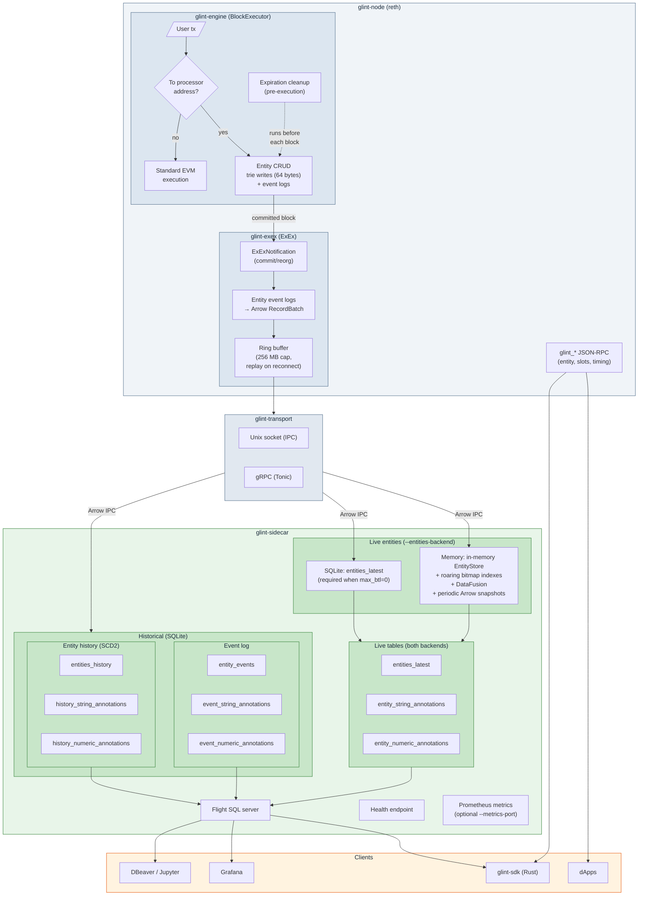

# Glint

[](https://github.com/vaporif/glint/actions/workflows/ci.yml)
[](https://github.com/vaporif/glint/actions/workflows/e2e.yml)
[](https://github.com/vaporif/glint/actions/workflows/audit.yml)
[](https://codecov.io/gh/vaporif/glint)

Ephemeral on-chain storage layer, built on reth.

Glint adds a BTL (Blocks-to-Live) primitive to Ethereum. Entities have a TTL, carry queryable annotations, and disappear when their time is up. BTL limits, payload sizes, and annotation constraints are all set in genesis. You can turn off BTL entirely (`max_btl: 0`) if you want permanent storage.

Runs as both a standalone Ethereum node (`eth-glint`) and an OP Stack L3 (`op-glint`).

The full flow (node startup, entity creation, ExEx streaming, Flight SQL queries) is covered by e2e tests.

## Why

Blockchains store data permanently. If you want to publish a limit order that's valid for the next 10 blocks, you pay to store it forever even though nobody needs it after that. There's no native TTL in Ethereum.

Think CoW Swap orders valid for minutes, oracle price feeds stale after a few blocks, compute marketplace offers that expire when filled, ephemeral task boards for AI agents.

## Getting started

Requires [Nix](https://nixos.org/) with flakes enabled, or Rust nightly + the tools listed in `flake.nix`.

```bash
# enter dev shell (installs rust toolchain, cargo-nextest, taplo, typos, etc.)
nix develop
# or: direnv allow

# build everything
just build

# run all checks (clippy + tests + fmt + lint)
just check
```

### Run locally

Terminal 1 - start the node in dev mode (auto-mines blocks every second):

```bash
just run-eth --dev --dev.block-time 1000ms --http
# or for OP Stack: just run-op --dev --dev.block-time 1000ms --http
```

Terminal 2 - start the sidecar (connects to the node's ExEx socket, serves Flight SQL + historical queries):

```bash
just run-sidecar
# or with unlimited BTL: just run-sidecar --genesis etc/genesis.json --entities-backend sqlite
```

The node listens on `localhost:8545` (JSON-RPC). The sidecar exposes Flight SQL on `localhost:50051` and health on `localhost:8080`.

### Query entities

Any Flight SQL client works. With `arrow-flight` CLI or DBeaver, connect to `localhost:50051`:

```sql
-- live entities (current state)
SELECT entity_key, content_type, expires_at_block FROM entities_latest;

-- annotation lookups via JOINs (bitmap-indexed)
SELECT e.entity_key, e.content_type
FROM entities_latest e
JOIN entity_string_annotations sa
  ON e.entity_key = sa.entity_key
WHERE sa.ann_key = 'pair' AND sa.ann_value = 'USDC/WETH';

SELECT e.entity_key, na.ann_value AS price
FROM entities_latest e
JOIN entity_numeric_annotations na
  ON e.entity_key = na.entity_key
WHERE na.ann_key = 'price' AND na.ann_value > 1000;

-- historical events (SQLite-backed, requires block range)
SELECT * FROM entity_events WHERE block_number BETWEEN 100 AND 200;

-- event annotations
SELECT e.entity_key, sa.ann_key, sa.ann_value
FROM entity_events e
JOIN event_string_annotations sa
  ON e.entity_key = sa.entity_key AND e.block_number = sa.block_number
WHERE e.block_number BETWEEN 100 AND 200;

-- entity state history (SCD2 - tracks every version of each entity)
SELECT entity_key, owner, valid_from_block, valid_to_block
FROM entities_history
WHERE block_number BETWEEN 0 AND 500;

-- history annotations
SELECT h.entity_key, sa.ann_key, sa.ann_value
FROM entities_history h
JOIN history_string_annotations sa
  ON h.entity_key = sa.entity_key AND h.valid_from_block = sa.valid_from_block
WHERE h.valid_from_block >= 0 AND h.valid_from_block <= 500;
```

Annotations live in separate tables, queried with standard SQL JOINs. Bitmap indexes cover all annotation columns.

### JSON-RPC

The node exposes a few entity-specific RPC methods alongside the standard Ethereum ones:

- `glint_getEntity(key)` - metadata, operator, content hash
- `glint_getEntityCount()` - total live entities
- `glint_getUsedSlots()` - storage slot count
- `glint_getBlockTiming()` - current block number and timestamp

## Configuration

All Glint parameters are set in the genesis file under `config.glint`:

```json
{
  "config": {
    "glint": {
      "max_btl": 302400,
      "max_ops_per_tx": 100,
      "max_payload_size": 131072,
      "max_annotations_per_entity": 64,
      "max_annotation_key_size": 256,
      "max_annotation_value_size": 1024,
      "max_content_type_size": 128,
      "processor_address": "0x000000000000000000000000000000676c696e74"
    }
  }
}
```

| Parameter | Default | Description |
|---|---|---|
| `max_btl` | 302,400 (~7 days at 2s blocks) | Max entity lifetime in blocks. `0` = unlimited. |
| `max_ops_per_tx` | 100 | Max operations per transaction. |
| `max_payload_size` | 131,072 (128 KB) | Max entity payload in bytes. |
| `max_annotations_per_entity` | 64 | Max string + numeric annotations per entity. |
| `max_annotation_key_size` | 256 | Max annotation key length in bytes. |
| `max_annotation_value_size` | 1,024 | Max string annotation value in bytes. |
| `max_content_type_size` | 128 | Max content-type string length. |
| `processor_address` | `0x...676c696e74` | Address that intercepts entity transactions. |

Any omitted field uses the default. Partial overrides work: `{"max_btl": 0}` gives unlimited BTL with all other defaults.

When `max_btl` is `0`, entities live until explicitly deleted. The sidecar reads genesis (`--genesis`) and forces `--entities-backend sqlite` since the in-memory store would grow forever. Node recovery scans from block 0 instead of a bounded window.

## Relationship to Arkiv

Glint wouldn't exist without [Arkiv](https://github.com/Arkiv-Network/arkiv-op-geth) (formerly GolemBase). The Arkiv team designed the core model - magic address interception, BTL expiration, content-addressed keys, annotation model, atomic ops, owner-gated mutations.

Why rewrite it? Optimism is moving from op-geth to reth. Glint takes the same ideas and implements them as a reth plugin using `BlockExecutor` and `ExEx`, no geth fork needed.

I also revisited a few design tradeoffs along the way:

| | Arkiv | Glint | Why |
|---|---|---|---|
| Base | op-geth fork | reth plugin (BlockExecutor + ExEx) | Follows Optimism's reth migration. |
| On-chain cost | ~96 bytes/entity (3 slots) | 64 bytes/entity (2 slots) | Expiration index moved off-chain into memory. |
| Content integrity | - | 32-byte content hash | Lets clients verify query results against the trie. |
| Query engine | SQLite with bitmap indexes, in-process, custom JSON-RPC | DataFusion (columnar, in-memory) with roaring bitmap indexes, separate process, Flight SQL | Process isolation, columnar scans for analytics. See [query engine](#query-engine). |
| Annotations | Embedded in entity rows, custom UDFs | Separate relational tables, standard SQL JOINs | Cleaner schema, no custom functions, better index selectivity. |
| Compression | Brotli per-tx | None | OP batcher already compresses the batch. |
| MAX_BTL | Uncapped | Configurable via genesis, 0 = unlimited | Bounds recovery time and index size when set. |
| Extend | Permissionless, no cap | Per-entity policy (anyone or owner/operator), capped at MAX_BTL when set | Creator chooses who can extend. |
| Operator delegation | - | Optional operator per entity | Backend can manage entities without owning them. |
| ChangeOwner | Supported | Supported | Transfer ownership, change extend policy, set/remove operator in one atomic op. |
| Historical queries | At-block JSON-RPC | SCD2 entity history + event log over Flight SQL | Full version history with temporal range queries. |

Arkiv also has things Glint doesn't yet - JSON-RPC query endpoints and glob matching on annotations. On the roadmap.

## Architecture



`glint-engine` is a custom `BlockExecutor` inside reth. Transactions sent to a magic address (`0x...676c696e74`, ASCII "glint") get intercepted as entity operations: create, update, delete, extend, change owner. Everything else goes through normal EVM execution. Each entity costs 64 bytes on-chain: 32 bytes of metadata (owner + expiration + flags) and 32 bytes of content hash. Expired entities get cleaned up before each block's transactions run.

`glint-exex` watches committed blocks, converts entity event logs into Arrow RecordBatches, holds them in a ring buffer (256 MB cap), and pushes them to the sidecar. The ring buffer gives roughly 34 minutes of headroom at 2s blocks, enough for the sidecar to restart and catch up without missing data.

`glint-transport` moves Arrow IPC bytes from the ExEx to the sidecar. Two options: a Unix domain socket (IPC, default) for co-located deployments, or gRPC via Tonic when the sidecar runs on a different host. The gRPC transport uses a small custom proto rather than Arrow Flight -- Flight is built for query-serving, not one-way push streams.

`glint-sidecar` is the query layer. It runs as a separate process, consumes the ExEx stream, and serves nine tables over Flight SQL:

| Table | Category | Description |
|---|---|---|
| `entities_latest` | Live | Current entities with metadata |
| `entity_string_annotations` | Live | String annotations for live entities |
| `entity_numeric_annotations` | Live | Numeric annotations for live entities |
| `entity_events` | Events (SQLite) | Raw lifecycle events, requires block range |
| `event_string_annotations` | Events (SQLite) | String annotations per event |
| `event_numeric_annotations` | Events (SQLite) | Numeric annotations per event |
| `entities_history` | History / SCD2 (SQLite) | Every version of each entity (`valid_from_block` / `valid_to_block`) |
| `history_string_annotations` | History / SCD2 (SQLite) | String annotations per history record |
| `history_numeric_annotations` | History / SCD2 (SQLite) | Numeric annotations per history record |

Live tables come from either the memory or SQLite backend. Event and history tables are always SQLite-backed and require bounded queries (block range or `valid_from` range).

If the sidecar crashes or falls behind, the node keeps producing blocks. On reconnect the ExEx replays from its ring buffer.

`glint-sdk` is a Rust client library for building and sending Glint transactions, querying entities over JSON-RPC, and running Flight SQL queries.

### Observability

The node and sidecar both export Prometheus metrics. The sidecar's scrape endpoint is opt-in (`--metrics-port`).

Engine metrics (`glint_engine_*`) track entity operations, expirations per block, gas consumed, and ops per transaction. Sidecar metrics (`glint_sidecar_*`) cover Flight SQL query count/errors/latency/rows, snapshot timing, full replays triggered, and SQLite database size.

### Query engine

The sidecar has two backends for live entity queries (`--entities-backend`):

**Memory (default)** - keeps all live entities in RAM with roaring bitmap indexes on owner and annotations. DataFusion does vectorized queries directly on Arrow data, no format conversion from ExEx through to results. Hash indexes on annotation key/value pairs, B-tree for numeric ranges, all backed by roaring bitmaps. Indexed lookups resolve in microseconds; everything else falls through to columnar scan. Works well when entities expire and the live set stays bounded. 100K entities with 10 annotations each and ~500 byte payloads is about 100MB. Periodic Arrow snapshots (configurable via `--snapshot-interval`) with Blake3 integrity verification let the sidecar resume from a checkpoint instead of replaying from scratch.

**SQLite** - persists live entities to disk in an `entities_latest` table with separate annotation tables. Required when `max_btl=0` since entities never expire and RAM would grow forever. Queries still go through DataFusion via SQLite-backed `TableProvider`s that push filters down to SQL.

Supported indexed operations: equality and inequality on `owner`, string annotation key/value, and numeric annotation key/value; range queries (`>`, `>=`, `<`, `<=`) on numeric annotations; `IN` lists on all indexed fields; `AND`/`OR` combinations. Unrecognized filters fall through to DataFusion's post-scan filtering.

<details>
<summary>Other query engines considered</summary>

- SQLite - good indexes, but row-oriented. Loses columnar analytics and needs Arrow-to-row conversion on every ingest. Considered as a backend behind DataFusion, but unnecessary when the live entity set fits in memory.
- DuckDB - C++ with Rust FFI. Fast, but adds a C++ dependency and ~30MB to the binary.
- SpacetimeDB - standalone server, can't use as a library. BSL licensed.
- ClickHouse via chdb-rust - ~125 downloads/month, experimental API, 300MB shared library.
- SurrealDB - BSL license and full DB engine overhead.
- Materialize / ReadySet / RisingWave - streaming SQL, all need separate servers. Materialize and ReadySet are BSL.
- Feldera (DBSP) - MIT licensed, but SQL layer needs a Java (Apache Calcite) build step.
- Parquet files from ExEx - duplicates data already in MDBX, reads are always stale, file management becomes the ExEx's problem.
</details>

## How it works

### Entity lifecycle

1. **Create** (anyone) - Send a transaction to the processor address with RLP-encoded `GlintTransaction` operations. The sender becomes the owner. The entity gets a deterministic key (`keccak256(tx_hash || payload_len || payload || op_index)`), 64 bytes written to trie, and a lifecycle event log emitted. The full payload lives only in the event log, not in the trie. You can optionally set an `operator` and an `extend_policy` at creation time.

   A 32-byte content hash goes on-chain so clients can verify query results against the trie. A malicious sequencer can't serve altered data without the hash mismatch showing up in a Merkle proof.

2. **Update** (owner or operator) - Replace payload and annotations, reset the BTL. Same key, new content. The operator can update content and BTL but cannot change permissions (extend_policy or operator) - only the owner can do that.

3. **Extend** (depends on policy) - Add blocks to remaining lifetime, capped at MAX_BTL when configured (no cap when `max_btl=0`). If `extend_policy` is `AnyoneCanExtend`, anyone can do this - so if you depend on someone's data, you can keep it alive. If `OwnerOnly`, only the owner or operator can extend.

4. **ChangeOwner** (owner only) - Transfer ownership, change the extend policy, and/or set or remove the operator, all in one atomic operation. At least one field must change. Operators cannot call this - only the entity owner.

5. **Delete** (owner or operator) - Immediate removal.

6. **Expire** (automatic) - At the start of each block, before any transactions execute, the engine checks an in-memory expiration index and removes everything whose TTL has elapsed. The index isn't stored on-chain - on cold start it rebuilds by scanning event logs (MAX_BTL blocks when capped, all blocks when `max_btl=0`).

### Recovery

Everything in-memory rebuilds from the chain. No snapshots, no separate sync mode.

On node restart, `glint-engine` scans entity event logs from reth's database to reconstruct the expiration index. When MAX_BTL is set, it only scans that many blocks back - at ~1 week of history (302,400 blocks at 2s) this takes seconds to a few minutes. When `max_btl=0` (unlimited), it scans from genesis.

On sidecar restart, it connects to the ExEx stream (IPC or gRPC) and rebuilds. If snapshots are enabled, it loads the most recent valid snapshot and replays only from that point forward. Without snapshots, it replays from empty. The ExEx fills in missing blocks from its ring buffer. With bounded BTL, after MAX_BTL blocks from tip all live entities are reconstructed since anything older is already expired. Historical events and entity history (SCD2) are persisted in SQLite and survive restarts. Crash, disconnect, fresh deploy - same path.

If the ring buffer overflows (~34 min of headroom at 2s blocks), it disconnects the sidecar, which does a full rebuild on reconnect. If the ExEx itself panics, reth keeps producing blocks and retains notifications until the ExEx catches up.

## License

Licensed under either of [Apache License, Version 2.0](LICENSE-APACHE) or [MIT License](LICENSE-MIT) at your option.
